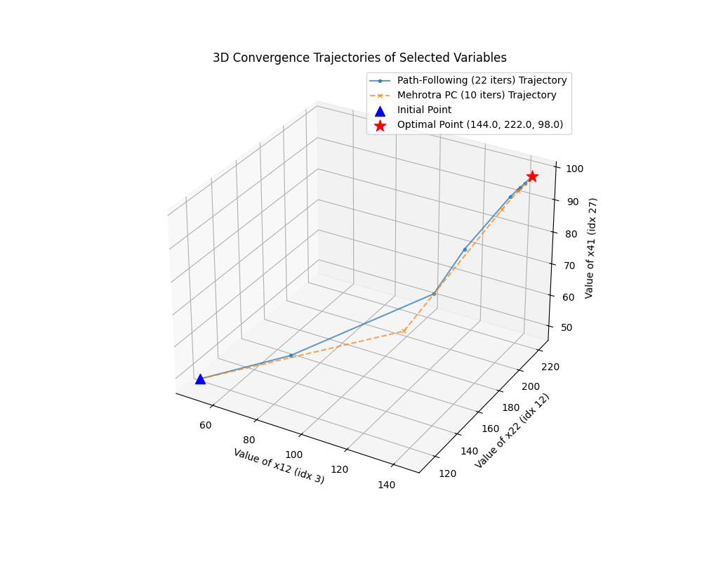
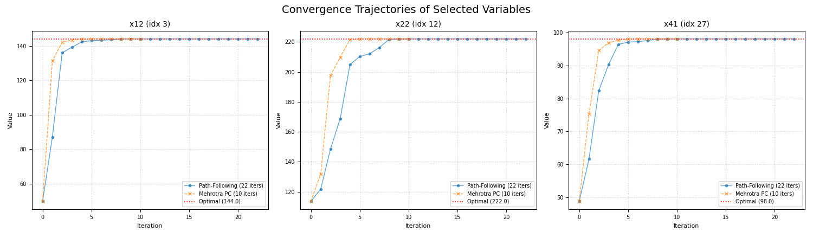

# Solving Linear Programming with Interior-Point Algorithms: Implementation and Benchmark on the Busing Problem

## Project Overview

This project explores the implementation and performance of two primal-dual Interior-Point Methods (IPMs) for solving Linear Programming (LP) problems:
1.  **Primal-Dual Path-Following (Long-Step) Algorithm**
2.  **Mehrotra's Predictor-Corrector Algorithm**

These algorithms were implemented in Python using NumPy and SciPy for numerical computations. Their performance was benchmarked against the "Busing Children to School" case study detailed in Lewis (2008). The results from the implemented solvers were also compared against the state-of-the-art open-source LP solver, HiGHS.

The primary goals were to:
- Understand the theoretical foundations and practical implementation details of these IPMs.
- Evaluate their convergence behavior, iteration count, and execution time.
- Analyze the impact of problem formulation and numerical stability techniques.
- Compare their performance against a production-grade solver.

## Case Study: The School Busing Problem

The "Busing Children to School" problem (Lewis, 2008) was used as the test case. The adopted LP formulation involved:
-   Assigning students from 6 areas to 3 schools across 3 grades.
-   Minimizing total busing costs.
-   Subject to:
    -   Student supply constraints from each area/grade.
    -   School capacity limits (School 1: 900, School 2: 1100, School 3: 1000).
    -   Grade percentage balance requirements (30%-36%) at each school (modeled as 18 individual inequality constraints).
    -   Handling of 3 infeasible routes (A2S1, A5S2, A4S3) by fixing corresponding variables to zero.
-   This resulted in an input LP with 54 potential variables (45 active decision variables) and 48 constraints, which was converted to a standard form of `m=48, n=72` for the IPM solvers.

## Implemented Solvers and Results

Both implemented IPMs and HiGHS successfully converged to the same optimal objective value for the defined Busing LP.

**Performance Summary on the Busing Problem:**

| Performance Metric         | Primal-Dual Path-Following | Mehrotra Predictor-Corrector | HiGHS Solver |
| :------------------------- |:---------------------------|:-----------------------------|:-------------|
| Optimal Objective Value    | 426553.57                  | 426553.57                    | 426553.57    |
| Total Iterations           | 22                         | 10                           | 11           |
| Total Execution Time (s)   | 0.0166                     | 0.0124                       | 0.0026       |
| Approx. Time per Iter. (s) | 0.008                      | 0.0012                       | 0.0002       |

**Key Observations:**
-   Mehrotra's Predictor-Corrector was more efficient in iterations and total time compared to the Path-Following method within the Python implementations.
-   HiGHS significantly outperformed the Python-based IPMs in execution speed.
-   Precise problem formulation, robust initial point generation, and numerical stability techniques were crucial for successful convergence.

## Convergence Visualization

**Figure 1. The convergence trajectories for selected variables**

**Figure 2. Iteration-wise convergence of each variable**

## Conclusion

The project successfully implemented and benchmarked two fundamental Primal-Dual Interior-Point Methods. The results on the Busing Problem demonstrated their capability to solve LPs to optimality, with Mehrotra's method showing better performance within the implemented framework. The study highlighted the efficiency of specialized solvers like HiGHS and underscored the importance of careful problem formulation and numerical considerations in developing optimization algorithms.

## References
1. Dikin, I. I. (1967). Iterative solution of problems of linear and quadratic programming. *Soviet Mathematics Doklady*, 8, 674-675.
2. Wright, S. J. (1997). *Primal-Dual Interior-Point Methods*. SIAM Publications.
3. Mehrotra, S. (1992). On the Implementation of a Primal-Dual Interior Point Method. *SIAM Journal on Optimization*, 2(4), 575-601.
4. Lewis, T. G. (2008). *Linear Programming: Theory and Applications* (Case Study: Busing Children to School). Whitman College, Department of Mathematics. [Often available online, e.g., https://www.whitman.edu/documents/academics/majors/mathematics/lewis.pdf]
5. Huangfu, Q., & Hall, J. A. J. (2018). Parallelizing the dual revised simplex method. *Mathematical Programming Computation*, 10(1), 119-142. 

## Code
The Python code for the implemented solvers, problem setup, and analysis can be found in this repository.
- `main.py`: Main script for running solvers and benchmarks.
- `long_step.py` and `mehrotra.py`: Contains implementations of PD and MPC algorithms.
- `[helper_functions.py]`: Contains utility functions like initial point, step size, etc.
- `[bus_problem.py]`: Contains the busing problem formulation function.